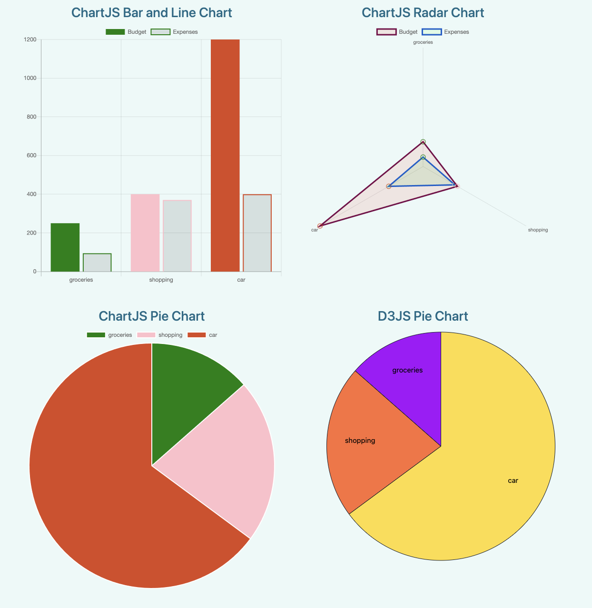

<br>

---

**Submitted By:**

- **Author Name:** Rhythm Agrawal
- **Student ID:** 801310679

- **Link for Live Demonstration:** [Live Demonstration]()

- Use the following credentials for testing:
  - **Username:** r@a.com
  - **Password:** test123

---

**Steps to Execute the Project**

_Note: Ensure the use of Node version 20.8.1. If any errors occur, delete the `node_modules` directory and proceed with the steps below again._

1. Go to the server directory:

   ```bash
   cd server
   npm install
   node server.js
   ```

2. Open a new terminal window and execute these commands:
   ```bash
   cd spend-wise
   npm install --force
   export NODE_OPTIONS=--openssl-legacy-provider
   ng serve
   ```

---

**Guidelines for Running Test Cases**

### E2E:

The test cases are located at:
`NBAD_SpendWise_Project/spend-wise/cypress/e2e`.

_Note: To execute the e2e test case, both the backend server (node server.js) and ng serve should be operational._

```bash
cd spend-wise
export APPLITOOLS_API_KEY=UGT6SGZonA5GCD8mlXSKnifPI1L1BJ2sC2LOAf105pjk4110
npx cypress open
```

#### Potential Errors:

"If encountering the error message 'Sorry, we could not load: http://localhost:4200/home'."

1. **Restart both the backend server (node server.js) and the frontend server (ng serve).**
2. **Attempt running the above commands again. This should resolve the issue.**

If experiencing issues related to Cypress installation, please execute these commands:

```bash
npm install cypress@13.6.1 -f
export APPLITOOLS_API_KEY=Fxs2XevR7jqp1mBFJOnIUJ1105ORvQJOvetSxUtki97w4110
npx cypress open
```

#### E2E Results


### Unit Tests

```bash
cd spend-wise
ng test
```

#### Results of Unit Tests


---

**Visual References:**

- **HomePage**
  

- **AboutPage**
  

- **Contact Page**
  

- **Login**
  

- **Register**
  

- **Dashboard**
  

- **Expense Table based on selected month**
  

- **Charts**
  

---
